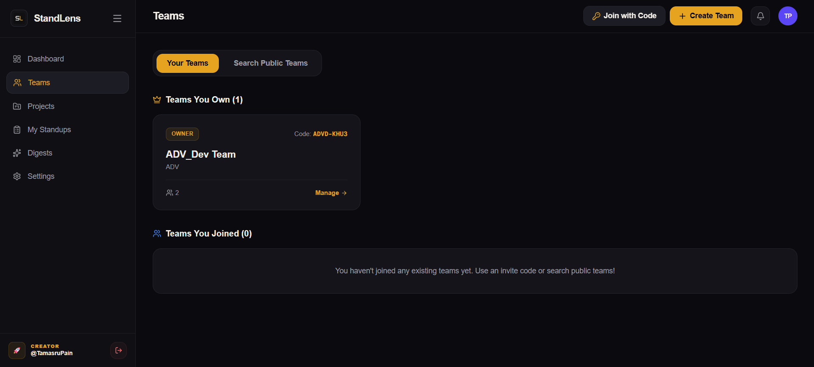
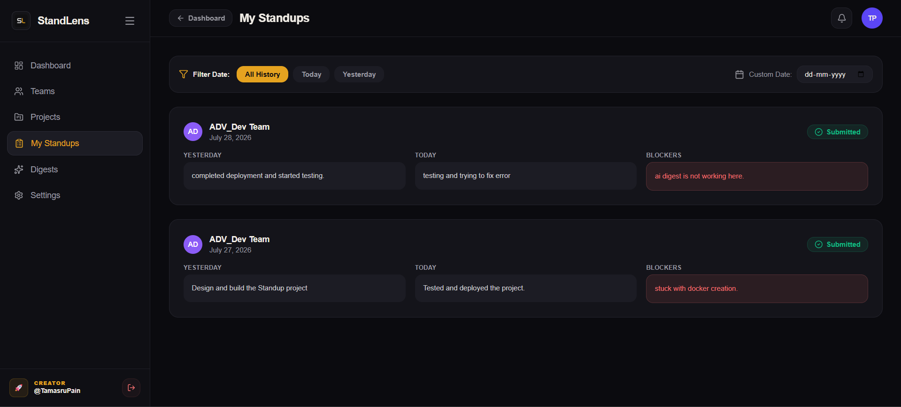
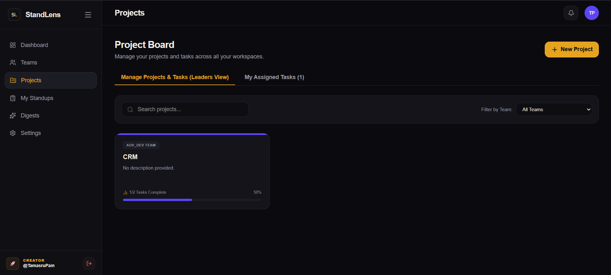

# 🔍 StandLens

**AI-powered async standup summarizer and task management system for dev teams.**

Replace long, synchronous daily standup meetings with async text updates. StandLens compiles daily standup entries and uses advanced AI to synthesize them into concise, actionable executive digests. It also integrates a fully featured project Kanban board, task assignment, real-time notifications, and team velocity insights.

---

## 📸 Preview

<p align="center">
  
</p>
<p align="center">
  
</p>
<p align="center">
  
</p>


---

## 🚀 Key Features

*   **⚡ Async Standup Submissions**: Developers can submit daily standups detailing:
    *   *Yesterday*: What was completed.
    *   *Today*: What is planned.
    *   *Blockers*: Any active impediments (which are auto-flagged).
*   **🤖 AI Executive Digests**: Automatically aggregates and synthesizes team standups into structured Markdown digests containing:
    *   *Summary*: A high-level 2-3 sentence overview of progress.
    *   *Highlights*: Major achievements and milestones.
    *   *Concerns*: Flagged blockers or risks requiring leadership attention.
*   **⛓️ AI Model Fallback Chain**: Utilizes OpenRouter API to route requests through a fallback list of free/high-performance models (`nemotron-3-super`, `ling-3.0-flash`, `gemma-3-27b`, and `deepseek-r1`). If all external AI endpoints fail or no API key is configured, the system gracefully uses a local template-based engine to generate digests.
*   **📋 Kanban Task Board**: A complete project management board with:
    *   Drag-and-drop task status columns (`TODO`, `IN_PROGRESS`, `IN_REVIEW`, `DONE`).
    *   Task priorities (`LOW`, `MEDIUM`, `HIGH`, `URGENT`).
    *   Interactive task details, checklist subtasks, activity logs, and team comments.
    *   Task assignees and assignment workflows.
*   **👥 Workspace & Team Management**:
    *   Role-based access control (`OWNER`, `ADMIN`, `MEMBER`).
    *   Discoverable teams list or private teams.
    *   Secure join request queue or instant joining using team invite codes.
*   **🔔 In-App Notification Center**: Instant user notifications for team join requests, approvals, task assignments, review requests, and digest releases.
*   **📊 Team Analytics**: Generates weekly trend insights, highlights recurring blockers, and provides team workload balancing profiles.

---

## 🛠️ Tech Stack

| Layer | Technology | Description |
| :--- | :--- | :--- |
| **Frontend** | [Next.js 16](https://nextjs.org/) | React Server Components, App Router, Client-side state |
| **Styling** | [TailwindCSS v4](https://tailwindcss.com/) & [shadcn/ui](https://ui.shadcn.com/) | Modern layout engine with custom dashboard designs |
| **Auth** | [BetterAuth](https://www.better-auth.com/) | Password-based and Social (Google) credentials provider |
| **Backend** | [NestJS](https://nestjs.com/) | Progressive Node.js framework for scalable API layers |
| **Database** | [PostgreSQL](https://www.postgresql.org/) ([Neon DB](https://neon.tech/)) | Serverless relational database hosting |
| **ORM** | [Prisma ORM](https://www.prisma.io/) | Schema definition, migrations, and database client generation |
| **Task Queue** | [BullMQ](https://bullmq.io/) & [Upstash Redis](https://upstash.com/) | Async job queuing for background tasks and digests |
| **AI Synthesis** | [OpenRouter API](https://openrouter.ai/) | Access to advanced open-source models with high-resilience fallback |

---

## 📂 Project Structure

This project is set up as a standard Node.js workspace (monorepo):

```
StandLens/
├── apps/
│   ├── web/                  # Next.js 16 Frontend Web Application
│   │   ├── src/app/          # Pages, layouts, routing structures
│   │   ├── src/components/   # Shared UI & feature-specific components
│   │   └── src/lib/          # Client utilities, BetterAuth client, and APIs
│   └── api/                  # NestJS Backend API Service
│       ├── src/              # App controller, modules, and service layers
│       │   ├── ai/           # OpenRouter API interaction service
│       │   ├── prisma/       # Database Client Module
│       │   ├── standups/     # Standups submissions endpoint
│       │   ├── digests/      # AI Summary synthesis endpoint
│       │   ├── teams/        # Workspaces and memberships endpoint
│       │   ├── tasks/        # Kanban board and task assignments
│       │   └── notifications/# Activity alerts and inbox notification service
│       └── prisma/           # Schema schema.prisma & seed.ts script
├── packages/
│   └── shared/               # Shared TypeScript models, enums, & constants
├── .env.example              # Template environment file
├── package.json              # Workspace-wide packages & scripts
└── README.md                 # Project documentation
```

---

## ⚙️ Environment Configuration

Copy `.env.example` to `.env` in the root directory:

```bash
cp .env.example .env
```

### Environment Variables Breakdown

| Variable | Description |
| :--- | :--- |
| `DATABASE_URL` | PostgreSQL connection string with SSL mode required (e.g. Neon DB). |
| `REDIS_URL` | Upstash Redis connection string (production) or `redis://localhost:6379` (local Docker). |
| `BETTER_AUTH_SECRET` | A secure, random 32-character secret key. |
| `BETTER_AUTH_URL` | URL of the authentication server (defaults to Next.js host: `http://localhost:3000`). |
| `GOOGLE_CLIENT_ID` / `_SECRET`| *(Optional)* Credentials for Google Social OAuth login. |
| `OPENROUTER_API_KEY` | OpenRouter developer key. If left blank, the app falls back to local template digests. |
| `NODE_ENV` | Environment context (e.g., `development`, `production`). |
| `API_PORT` / `WEB_PORT` | Local service ports (API defaults to `4000`, Web to `3000`). |
| `API_URL` | Endpoint where the backend NestJS service is reachable. |
| `SMTP_HOST` / `_PORT` / `_USER` | *(Optional)* SMTP credentials for sending reset password emails. |

---

## 🏃 Getting Started

Follow these steps to set up and run the StandLens codebase locally:

### 1. Prerequisites
- **Node.js**: Version `>= 20.0.0`
- **Database**: A PostgreSQL instance (e.g., Neon DB)
- **Redis**: A running Redis instance or Docker container (`docker run -d -p 6379:6379 redis:alpine`)

### 2. Install Dependencies
Run the install command at the root of the monorepo to bootstrap the workspace:
```bash
npm install
```

### 3. Setup Database Schema
Generate the Prisma Client and execute database migrations:
```bash
npm run db:migrate
```

### 4. Seed Seed Data
Populate the database with sample developers, a team, and standup entries:
```bash
npm run db:seed
```
*Note: This creates mock accounts like `alex@example.com` and `sarah@example.com` with a sample workspace "Acme Frontend Devs" so you can test features instantly.*

### 5. Start Development Servers
You can run the web and API servers concurrently using the workspace scripts:
```bash
# Start Next.js Frontend (runs on http://localhost:3000)
npm run dev:web

# Start NestJS Backend API (runs on http://localhost:4000)
npm run dev:api
```

---

## 📜 Monorepo Scripts Reference

All primary operations can be executed from the root folder:

| Command | Workspace Target | Description |
| :--- | :--- | :--- |
| `npm run dev:web` | `apps/web` | Starts the Next.js development server with `.env` variables |
| `npm run dev:api` | `apps/api` | Starts the NestJS development server in watch mode |
| `npm run build:web` | `apps/web` | Compiles the Next.js frontend application for production |
| `npm run build:api` | `apps/api` | Compiles the NestJS backend application |
| `npm run db:migrate` | `apps/api` | Runs pending database migrations using Prisma |
| `npm run db:seed` | `apps/api` | Seeds the database with mock records (users, team, updates) |
| `npm run db:generate`| `apps/api` | Generates a fresh Prisma client matching the current schema |
| `npm run db:studio` | `apps/api` | Launches Prisma Studio to view/edit database records visually |
| `npm run lint` | *All* | Lints codebases across both apps and shared packages |
| `npm run format` | *All* | Formats codebase files according to Prettier settings |

---

## 🤖 AI Digest & Fallback Architecture

StandLens uses a highly resilient AI service:
1. When a team digest is triggered (either manually or via scheduler), the backend collects all standup submissions for that day.
2. It constructs a structured prompt and dispatches it to the **OpenRouter API**.
3. It tries the models in order: **Nemotron-3-Super** ➡️ **Ling-3.0-Flash** ➡️ **Gemma-3-27b-it** ➡️ **DeepSeek-R1**.
4. If a model fails or is rate-limited, it automatically falls back to the next model in the chain.
5. If all models fail (or `OPENROUTER_API_KEY` is not provided), it falls back to a **local template generator** that compiles a clean, formatted Markdown digest highlighting each user's progress and active blockers without hitting external services.

---

## 🔒 BetterAuth & Endpoint Guarding

- **Authentication**: Handled on the frontend via Next.js `/api/auth/[...all]` catch-all routes routing through the Prisma adapter.
- **Backend Authorization**: The NestJS API expects the client to pass the user's ID in the request headers (`x-user-id`) for REST requests. The Next.js frontend client (`api-client.ts`) attaches this automatically for authenticated sessions.
- **Route Protection**: Protects client-side paths `/dashboard`, `/teams`, `/digests`, `/standups`, and `/settings` from anonymous access.

---

## 📄 License

This project is licensed under the [MIT License](LICENSE).
